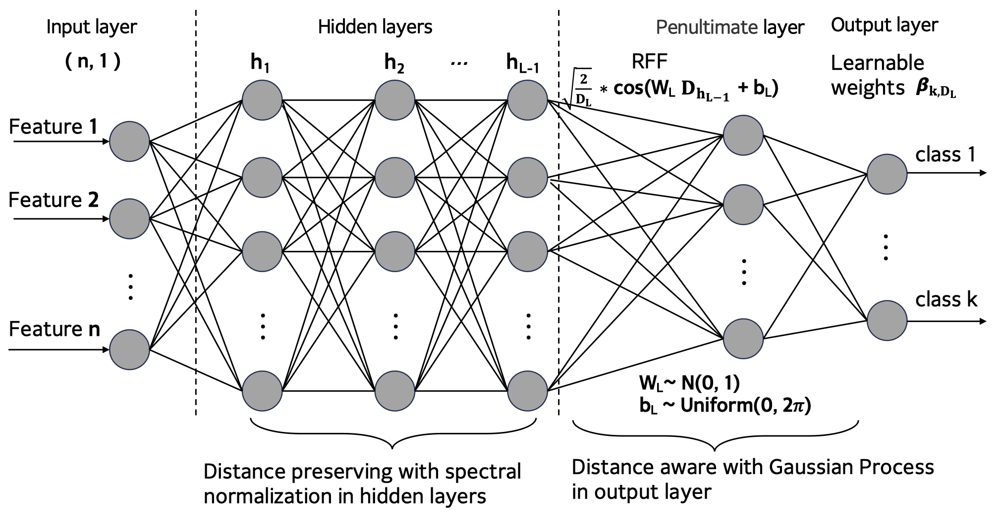
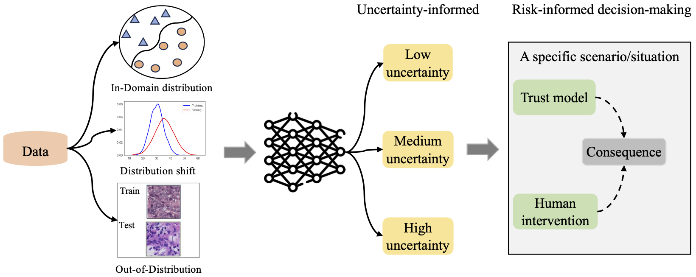

# A unified uncertainty-informed approach for risk management of deep learning models in the open world

The official implementation of the paper ["A unified uncertainty-informed approach for risk management of deep learning models in the open world"].

&nbsp;



To install requirements:

```setup
pip install -r requirements.txt
```

